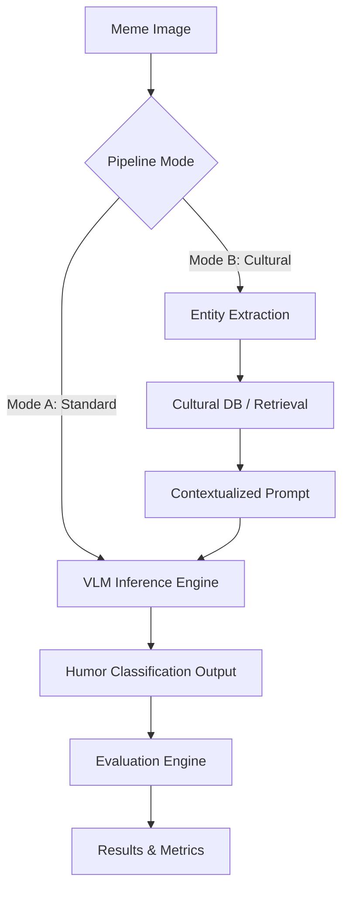

# System Architecture

The architecture of the Culturally-Aware VLM pipeline is designed for modularity and rigorous evaluation.

## Key Components:
- **Experiment Manager:** Orchestrates the pipeline, ensuring exact configurations are tracked and repeatable.
- **VLM Inference Engine:** Handles the interface with models (e.g., Qwen-VL) to process images and prompts.
- **Cultural Retrieval Module:** Manages the injection of context (utilized in Mode B).
- **Evaluation Engine:** Computes metrics (Macro F1, Accuracy) and records parsing failures.
